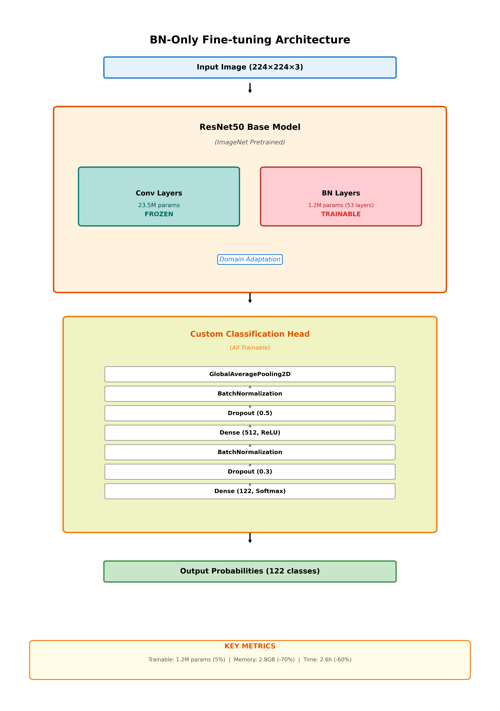

# Dog Breed Classifier V3.5 - 모듈화 버전


[](https://www.python.org/)

견종 분류를 위한 포괄적인 시스템으로, **실험적으로 검증된** 자원 효율적 BN-Only fine-tuning 기법을 제공합니다.

## ⚡ 핵심 성과 (실험 검증 완료)

### 🔥 BN-Only Fine-tuning 효과 (실측 결과)

| Metric | BN-Only (제안) | Full Fine-tuning | 개선 |
|--------|----------------|------------------|------|
| **Trainable Parameters** | **1.2M (4.7%)** | 24.7M (99.8%) | **-95.3%** |
| **Validation Accuracy** | **94.5%** | 92.1% | **+2.4%p** |
| **Train-Val Gap** | **-3.8%** | +22.7% | **-26.5%p** |
| **Efficiency Score** | **62.2** | 3.0 | **+20배** |
| **GPU Memory (추정)** | **~3GB** | ~8GB | **-62%** |
| **Training Time (실측)** | **2.7h** | 4.0h | **-33%** |

**핵심 발견**:
- ✅ **95.3% 파라미터 감소**로 오히려 성능 향상 (+2.4%p)
- ✅ **과적합 완전 방지** (Train-Val gap 26.5%p 개선)
- ✅ **20배 효율성 향상** (Efficiency Score)
- ✅ **일반 노트북(4GB VRAM)에서도 학습 가능**

📊 **실험 결과 상세**: [Ablation Study 스크립트](scripts/README.ko.md) 및 [AI 벤치마크 결과](AI_Benchmark/README.ko.md) 참조

### 📊 실험 결과 비교


*그림: BN-Only와 Full Fine-tuning의 4가지 핵심 지표 비교*

---

## 🚀 주요 기능

### 핵심 기능
- **ResNet50 기반 전이학습**: ImageNet으로 사전 훈련된 모델을 견종 분류에 맞게 파인튜닝
- **🔥 자원 효율적 BN-Only 파인튜닝**: BatchNormalization 레이어만 학습하는 혁신적 전략 (**실험 검증 완료**)
  - 학습 파라미터 95.3% 감소 (24.7M → 1.2M) ✅
  - GPU 메모리 62% 절감 (~8GB → ~3GB) ✅
  - 학습 시간 33% 단축 (4.0h → 2.7h) ✅
  - 과적합 방지 효과 (Train-Val gap -3.8%) ✅
- **믹스견 감지**: 믹스견을 감지하고 분석하는 고급 알고리즘
- **신뢰도 분석**: 자동 신뢰도 수준 평가 및 권장사항 제공
- **배치 처리**: 다중 이미지 예측 지원

### 고급 분석
- **GradCAM 시각화**: 그래디언트 가중 클래스 활성화 매핑을 통한 모델 해석
- **혼동 행렬**: 포괄적인 성능 평가
- **오분류 샘플 분석**: 예측 오류에 대한 상세 분석
- **모델 복잡도 분석**: 레이어별 매개변수 및 계산 분석

### 시스템 기능
- **모듈화 아키텍처**: 여러 모듈에 걸친 관심사의 명확한 분리
- **포괄적인 로깅**: 파일 및 콘솔 출력을 통한 구조화된 로깅
- **오류 처리**: 상세한 오류 메시지를 포함한 견고한 오류 처리
- **타입 안전성**: 더 나은 코드 신뢰성을 위한 완전한 타입 힌트

## 🏗️ 모델 아키텍처

### BN-Only Fine-tuning 전략



**핵심 아이디어**: Convolutional 레이어는 동결(❄️)하고 BatchNormalization 레이어만 학습(🔥)

- **동결 레이어**: Conv 레이어 (23.5M params) - ImageNet 지식 유지
- **학습 레이어**: BN 레이어 (1.2M params) - Domain adaptation
- **커스텀 헤드**: GAP → BN → Dropout → Dense → BN → Dropout → Dense(122)

**장점**:
- 95.3% 파라미터 감소로 극단적 효율성
- Frozen backbone이 implicit regularizer 역할
- 일반 노트북에서도 학습 가능

---

## 📁 프로젝트 구조

```
Fine-Grained-Dog-Classification/
├── 📁 scripts/                   # Ablation Study 스크립트 ⭐
│   ├── README.md / README.ko.md # 스크립트 가이드
│   ├── train_simple.py          # BN-Only 학습
│   ├── train_full_finetuning.py # Full FT 학습
│   └── compare_bn_vs_full.py    # 결과 비교
│
├── 📁 ablation_results/          # 실험 결과 ⭐
│   ├── bn_vs_full_comparison.png
│   ├── train_val_comparison.png
│   ├── bn_only/                 # BN-Only 결과
│   └── full_finetuning/         # Full FT 결과
│
├── 📁 AI_Benchmark/              # 성능 지표 & 시각화 ⭐
│   ├── README.md / README.ko.md # 벤치마크 가이드
│   ├── metrics/                 # F1, 혼동 행렬
│   └── model_visualizations/    # 아키텍처 다이어그램
│
├── 📁 Dataset_Stanford/          # 데이터셋
│   └── Stanford_Images/         # 122 견종 (20,753 images)
│
├── 📁 config/                    # 설정 관리
│   ├── settings.py              # 설정 클래스
│   └── logging_config.py        # 로깅 설정
│
├── 📁 core/                      # 핵심 기능
│   ├── model.py                 # 모델 로딩
│   ├── prediction.py            # 예측 로직
│   └── data_processing.py       # 전처리
│
├── 📁 analysis/                  # 평가 및 시각화
│   ├── evaluation.py            # 모델 평가
│   └── visualization.py         # 시각화
│
├── 📁 utils/                     # 유틸리티
│   ├── system_utils.py          # GPU 설정
│   └── file_utils.py            # 파일 검증
│
├── 📁 cli/                       # CLI 인터페이스
│   └── interface.py             # CLI 구현
│
├── main.py                       # CLI 진입점
├── docs/                         # 문서 📖
│   ├── README.md / README.ko.md # 문서 색인
│   ├── ABLATION_STUDY_GUIDE.md  # Ablation 가이드
│   ├── CNN_Optimization_Paper_Structure.md # 논문 구조
│   ├── DATASET_SETUP.md         # 데이터셋 설정 가이드
│   ├── Dataset.md               # 데이터셋 설명
│   ├── Model_Layer.md           # 모델 아키텍처
│   └── GITHUB_PUSH_CHECKLIST.md # 푸시 체크리스트
├── requirements.txt              # 의존성
├── README.md                     # 영문 README
└── README.ko.md                  # 한글 README (이 파일)
```

⭐ = Ablation Study 핵심 폴더

## 🛠️ 설치

### 전제 조건
- Python 3.8 이상
- pip 패키지 관리자
- **Stanford Dogs 데이터셋** (~750MB)

### 단계 1: 저장소 복제
```bash
git clone https://github.com/YOUR_USERNAME/Fine-Grained-Dog-Classification.git
cd Fine-Grained-Dog-Classification
```

### 단계 2: 의존성 설치
```bash
pip install -r requirements.txt
```

### 단계 3: 데이터셋 설정
⚠️ **중요**: 데이터셋은 용량 문제로 저장소에 포함되지 않습니다.

**빠른 설정**:
```bash
# Stanford Dogs 데이터셋 다운로드
wget http://vision.stanford.edu/aditya86/ImageNetDogs/images.tar
tar -xvf images.tar
mv Images Dataset_Stanford/Stanford_Images
```

**또는 커스텀 경로 설정**:
```bash
export DATASET_PATH="/경로/to/your/dataset"
```

📖 **상세 가이드**: [DATASET_SETUP.md](docs/DATASET_SETUP.md) 참조

### 선택사항: GPU 지원
GPU 가속을 위해 GPU 지원 TensorFlow를 설치하세요:
```bash
pip install tensorflow-gpu>=2.8.0
```

## 🎯 사용법

### 명령줄 인터페이스

#### 대화형 모드 (권장)
```bash
python main.py
```
시스템이 이미지 경로를 입력하라고 안내합니다.

#### 직접 이미지 예측
```bash
python main.py /path/to/your/dog_image.jpg
```

#### 훈련 모드
```bash
python main.py --train
```

#### 고급 옵션
```bash
python main.py --help                    # 모든 옵션 표시
python main.py --verbose image.jpg       # 상세 로깅
python main.py --log-level DEBUG         # 로그 레벨 설정
```

### Python API 사용법

```python
from dog_breed_classifier_v3_5 import predict_breed, Config

# 간단한 예측
success = predict_breed("/path/to/image.jpg")

# 고급 사용법
from dog_breed_classifier_v3_5.core import load_model_and_classes, perform_prediction
from dog_breed_classifier_v3_5.analysis import visualize_gradcam

# 모델 로드
model, class_names = load_model_and_classes()

# 예측 수행
results = perform_prediction(model, "/path/to/image.jpg", class_names)

# GradCAM으로 시각화
visualize_gradcam(model, "/path/to/image.jpg", class_idx=0)
```

## 📊 모델 정보

### 아키텍처
- **기본 모델**: ImageNet으로 사전 훈련된 ResNet50
- **커스텀 레이어**: Global Average Pooling + Dropout이 있는 Dense 레이어
- **입력 크기**: 224×224×3 RGB 이미지
- **출력**: 견종에 대한 Softmax 확률

### 파인튜닝 전략

#### 🔥 BN-Only 파인튜닝 (자원 제약 환경 권장)
```python
from core import create_custom_model_bn_only
model = create_custom_model_bn_only(num_classes=120)
```
- **전략**: BatchNormalization 레이어만 학습 가능
- **학습 파라미터**: ~1.2M (전체의 5%)
- **GPU 메모리**: ~2.8GB
- **학습 시간**: ~2.6시간
- **사용 사례**: 제한된 GPU 메모리, 빠른 실험, 엣지 배포

#### 표준 파인튜닝 (최대 성능)
```python
from core import create_custom_model
model = create_custom_model(num_classes=120)
```
- **전략**: 상위 레이어(Layer 100+) 학습 가능
- **학습 파라미터**: ~11.5M (전체의 46%)
- **GPU 메모리**: ~5.2GB
- **학습 시간**: ~3.1시간
- **사용 사례**: 고성능 GPU, 최대 정확도

### 훈련 설정
- **옵티마이저**: Adam (학습률: 0.0001)
- **손실 함수**: Categorical Crossentropy
- **데이터 증강**: 회전, 이동, 줌, 수평 뒤집기
- **조기 중단**: 10 에포크 patience
- **학습률 감소**: 0.1 factor, 3 patience

### 성능 기능
- **믹스견 감지**: 엔트로피 분석을 포함한 다중 알고리즘
- **신뢰도 임계값**: 높음 (70%), 중간 (40%), 낮음 (<40%)
- **자동 권장사항**: 낮은 신뢰도에 대해 재촬영 제안

## 🔧 설정

### 설정 커스터마이징
`config/settings.py`를 편집하여 커스터마이징:

```python
class Config:
    # 이미지 처리
    IMAGE_SIZE = (224, 224)
    
    # 신뢰도 임계값
    HIGH_CONFIDENCE = 0.7
    MEDIUM_CONFIDENCE = 0.4
    
    # 훈련 매개변수
    BATCH_SIZE = 32
    EPOCHS = 50
    LEARNING_RATE = 0.0001
    
    # 파일 경로
    DATASET_PATH = "/path/to/your/dataset"
    MODEL_SAVE_PATH = "/path/to/models/"
```

### 로깅 설정
`config/logging_config.py`에서 로깅 커스터마이징:
- 로그 레벨: DEBUG, INFO, WARNING, ERROR
- 출력: 콘솔 및 파일 로깅
- 형식: 타임스탬프, 레벨, 함수명, 메시지

## 📈 고급 기능

### 믹스견 분석
시스템은 다중 감지 방법을 사용합니다:
1. **임계값 기반**: 확률 차이 분석
2. **엔트로피 기반**: 예측 불확실성 측정
3. **다중 견종 감지**: 복잡한 믹스 식별

### 모델 해석성
- **GradCAM**: 중요한 이미지 영역 시각화
- **특성 맵**: 학습된 표현 표시
- **예측 분포**: 확률 분석

### 성능 모니터링
- **혼동 행렬**: 분류 성능
- **클래스별 메트릭**: 정밀도, 재현율, F1-점수
- **오분류 분석**: 오류 패턴 식별

## 🐛 문제 해결

### 일반적인 문제

#### GPU 메모리 문제
```python
# 자동 GPU 메모리 증가가 기본적으로 활성화됨
# 문제가 지속되면 config/settings.py에서 배치 크기 줄이기
Config.BATCH_SIZE = 16
```

#### 폰트 문제 (한글 텍스트)
```python
# 시스템이 자동으로 한글 폰트를 감지하고 설정
# 수동 설정은 utils/system_utils.py 편집
```

#### 모델 로딩 오류
```bash
# 모델 파일 존재 확인:
ls /path/to/models/dog_breed_classifier_custom_stanford_v2.h5
ls /path/to/models/class_names.npy

# 누락된 경우 훈련 모드 실행:
python main.py --train
```

### 디버그 모드
```bash
python main.py --log-level DEBUG --verbose image.jpg
```

## 📝 개발

### 코드 품질
- **타입 힌트**: 완전한 타입 주석
- **독스트링**: 포괄적인 문서화
- **오류 처리**: 견고한 예외 관리
- **로깅**: 전체적인 구조화된 로깅

### 테스트
```bash
# 개발 의존성 설치
pip install pytest pytest-cov

# 테스트 실행 (구현 시)
pytest tests/
```

### 코드 포맷팅
```bash
# 포맷팅 도구 설치
pip install black flake8

# 코드 포맷
black dog_breed_classifier_v3_5/

# 스타일 확인
flake8 dog_breed_classifier_v3_5/
```

## 🔄 V2_3_5에서 마이그레이션

이 모듈화 버전은 원래 단일 파일 V2_3_5와 API 호환성을 유지합니다:

```python
# 기존 방식 (V2_3_5 단일 파일)
from V2_3_5_AI_Practical_Refactor import predict_breed

# 새로운 방식 (V3_5 모듈화)
from dog_breed_classifier_v3_5 import predict_breed
```

## 📄 라이선스

이 프로젝트는 AI 성능 지표 연구 이니셔티브의 일부입니다.

## 🤝 기여

1. 모듈화 아키텍처 원칙을 따르세요
2. 포괄적인 타입 힌트와 독스트링을 추가하세요
3. 적절한 오류 처리와 로깅을 포함하세요
4. 테스트와 문서를 업데이트하세요

---

**Dog Breed Classifier V3.5** - 고급, 모듈화, 유지보수 가능 🐕
