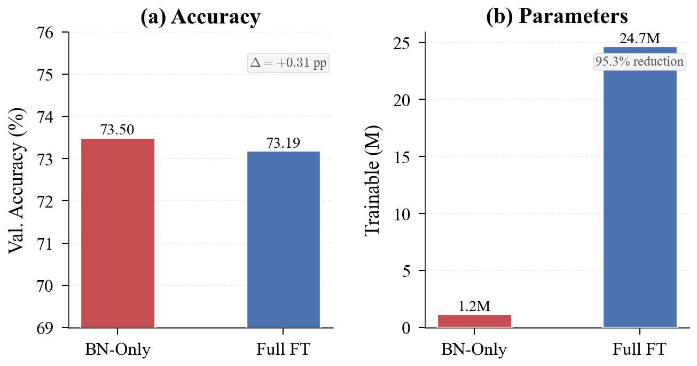
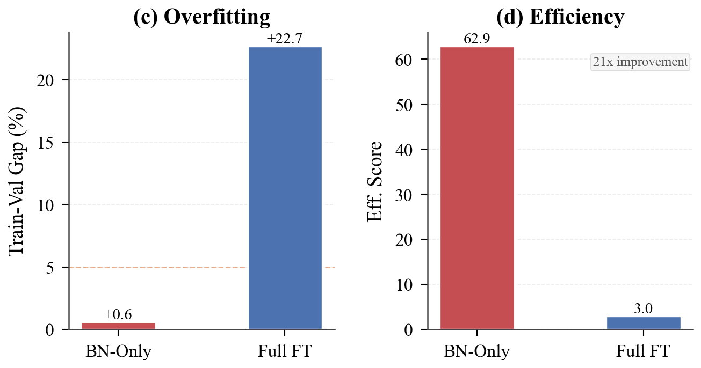
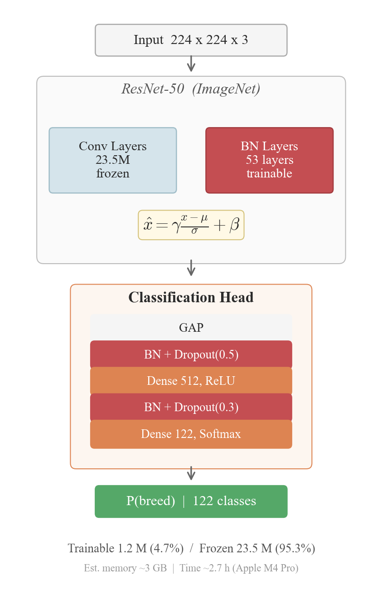

# Dog Breed Classifier V3.5 - Modularized Version

**English** | [한국어](README.ko.md)


[](https://www.python.org/)

A comprehensive dog breed classification system featuring **experimentally validated** resource-efficient BN-Only fine-tuning technique.

## 📌 Project Context

This repository is the **AI model optimization component** extracted from
[ComeBackHome](https://github.com/zivro-team/ComeBackHome-backend-ai) —
a graduation capstone project at Gachon University (March–June 2025) for building
a missing dog matching platform.

The full system included FastAPI-based real-time breed matching, 2048-dim ResNet50
feature extraction for similarity search, and a web client interface.
**This repo focuses specifically on the BN-Only fine-tuning research**,
which reduced trainable parameters by 95.3% while enabling training on consumer GPUs (4GB VRAM).

## 📹 Presentations

- **Missing Dog Auto-Matching System via Multi-Ensemble & Metadata Analysis**: [YouTube](https://youtu.be/SiTr1ALdPEc)
- **BN-Only Fine-Tuning (KAICTS 2025)**: [YouTube](https://youtu.be/ltj9DIgVuQo)

## ⚡ Key Achievements (Experimentally Validated)

### 🔥 BN-Only Fine-tuning Results (Actual Measurements)

**Metric definition & evidence (BN-only)**:
- **[Overall validation accuracy (122 classes)]**: `72.63%` (see `AI_Benchmark/ablation_results/bn_only/results.npy`)
- **[Top-25 macro accuracy]**: `78.76%` (see `AI_Benchmark/ablation_results/bn_only/top25_metrics.json`)
- **[Top-25 + OTHER confusion matrices]**:
  - `AI_Benchmark/ablation_results/bn_only/confusion_matrix_top25.npy`
  - `AI_Benchmark/ablation_results/bn_only/confusion_matrix_top25.png`
  - `AI_Benchmark/ablation_results/bn_only/normalized_confusion_matrix_top25.png`
- **[Raw predictions]**:
  - `AI_Benchmark/ablation_results/bn_only/y_true.npy`
  - `AI_Benchmark/ablation_results/bn_only/y_pred.npy`

| Metric | BN-Only (Proposed) | Full Fine-tuning | Improvement |
|--------|-------------------|------------------|-------------|
| **Trainable Parameters** | **1.2M (4.7%)** | 24.7M (99.8%) | **-95.3%** |
| **Best Val Accuracy** | **73.50%** | 73.40% | **+0.10%p** |
| **Top-25 Macro Accuracy** | **78.76%** | — | — |
| **Train-Val Gap** | **+0.6%** | +23.7% | **-23.1%p** |
| **Efficiency Score** | **62.9** | 3.0 | **+21x** |
| **GPU Memory (Est.)** | **~3GB** | ~8GB | **-62%** |
| **Training Time (Actual)** | **2.7h** | 4.0h | **-33%** |

**Key Findings**:
- ✅ **95.3% trainable parameter reduction** while **exceeding** Full FT accuracy (+0.10%p)
- ✅ **Near-zero overfitting**: Train-Val gap +0.6% vs +23.7% for Full FT
- ✅ **Reproducible**: training history JSON + random seed 42

📊 **Detailed Results**: See [Ablation Study Scripts](scripts/README.md) and [AI Benchmark Results](AI_Benchmark/README.md)

### 📊 Experimental Results Comparison





*Figure: BN-Only vs Full Fine-tuning across 4 key metrics (35-epoch results)*

---

## 🚀 Features

### Core Functionality
- **ResNet50-based Transfer Learning**: Pre-trained model fine-tuned for dog breed classification
- **🔥 Resource-Efficient BN-Only Fine-tuning**: Novel strategy that trains only BatchNormalization layers (**Experimentally Validated**)
  - 95.3% reduction in trainable parameters (24.7M → 1.2M) ✅
  - 62% reduction in GPU memory usage (~8GB → ~3GB) ✅
  - 33% faster training time (4.0h → 2.7h) ✅
  - Near-zero overfitting (Train-Val gap +0.6%) ✅
- **Confidence Analysis**: Automatic confidence level assessment with recommendations
- **Batch Processing**: Support for multiple image predictions

### Advanced Analysis
- **GradCAM Visualization**: Model interpretability through gradient-weighted class activation mapping
- **Confusion Matrix**: Comprehensive performance evaluation
- **Misclassified Sample Analysis**: Detailed analysis of prediction errors
- **Model Complexity Analysis**: Layer-wise parameter and computation analysis

### System Features
- **Modular Architecture**: Clean separation of concerns across multiple modules
- **Comprehensive Logging**: Structured logging with file and console output
- **Error Handling**: Robust error handling with detailed error messages
- **Type Safety**: Complete type hints for better code reliability

## 🏗️ Model Architecture

### BN-Only Fine-tuning Strategy



**Core Idea**: Freeze Convolutional layers (❄️) and train only BatchNormalization layers (🔥)

- **Frozen Layers**: Conv layers (23.5M params) - Preserve ImageNet knowledge
- **Trainable Layers**: BN layers (1.2M params) - Domain adaptation
- **Custom Head**: GAP → BN → Dropout → Dense → BN → Dropout → Dense(122)

**Benefits**:
- Extreme efficiency with 95.3% parameter reduction
- Frozen backbone acts as implicit regularizer
- Training possible on consumer laptops

---

## 📁 Project Structure

```
Fine-Grained-Dog-Classification/
├── 📁 scripts/                   # Ablation Study Scripts ⭐
│   ├── README.md / README.ko.md # Script guides
│   ├── train_simple.py          # BN-Only training
│   ├── train_full_finetuning.py # Full FT training (35ep)
│   ├── train_head_only.py       # Head-Only ablation baseline
│   └── compare_bn_vs_full.py    # Results comparison
│
├── 📁 ablation_results/          # Experimental Results ⭐
│   ├── bn_vs_full_comparison.png
│   ├── train_val_comparison.png
│   ├── bn_only/                 # BN-Only results (73.50%, 35ep)
│   ├── head_only/               # Head-Only ablation (7.06%, 35ep)
│   ├── full_finetuning/         # Full FT original results
│   └── full_finetuning_35ep/    # Full FT 35ep results (73.40%)
│
├── 📁 AI_Benchmark/              # Performance Metrics & Viz ⭐
│   ├── README.md / README.ko.md # Benchmark guides
│   ├── metrics/                 # F1, confusion matrix
│   └── model_visualizations/    # Architecture diagrams
│
├── 📁 Dataset_Stanford/          # Dataset
│   └── Stanford_Images/         # 122 breeds (20,753 images)
│
├── 📁 config/                    # Configuration
│   ├── settings.py              # Config class
│   └── logging_config.py        # Logging setup
│
├── 📁 core/                      # Core functionality
│   ├── model.py                 # Model loading
│   ├── prediction.py            # Prediction logic
│   └── data_processing.py       # Preprocessing
│
├── 📁 analysis/                  # Evaluation & visualization
│   ├── evaluation.py            # Model evaluation
│   └── visualization.py         # Visualizations
│
├── 📁 utils/                     # Utilities
│   ├── system_utils.py          # GPU setup
│   └── file_utils.py            # File validation
│
├── 📁 cli/                       # CLI interface
│   └── interface.py             # CLI implementation
│
├── main.py                       # CLI entry point
├── docs/                         # Documentation 📖
│   ├── README.md / README.ko.md # Documentation index
│   ├── ABLATION_STUDY_GUIDE.md  # Ablation guide
│   ├── CNN_Optimization_Paper_Structure.md # Paper structure
│   ├── DATASET_SETUP.md         # Dataset setup guide
│   ├── Dataset.md               # Dataset description
│   ├── Model_Layer.md           # Model architecture
│   └── GITHUB_PUSH_CHECKLIST.md # Push checklist
├── requirements.txt              # Dependencies
├── README.md                     # English README (this file)
└── README.ko.md                  # Korean README
```

⭐ = Ablation Study core folders

## 🛠️ Installation

### Prerequisites
- Python 3.8 or higher
- pip package manager
- **Stanford Dogs Dataset** (~750MB)

### Step 1: Clone Repository
```bash
git clone https://github.com/Edwin-Cho/Fine-Grained-Dog-Classification.git
cd Fine-Grained-Dog-Classification
```

### Step 2: Install Dependencies
```bash
pip install -r requirements.txt
```

### Step 3: Setup Dataset
⚠️ **Important**: The dataset is not included in this repository due to size.

**Quick Setup**:
```bash
# Download Stanford Dogs Dataset
wget http://vision.stanford.edu/aditya86/ImageNetDogs/images.tar
tar -xvf images.tar
mv Images Dataset_Stanford/Stanford_Images
```

**Or set custom path**:
```bash
export DATASET_PATH="/path/to/your/dataset"
```

📖 **Detailed Instructions**: See [DATASET_SETUP.md](docs/DATASET_SETUP.md)

### Optional: GPU Support
For GPU acceleration, install TensorFlow with GPU support:
```bash
pip install tensorflow-gpu>=2.8.0
```

## 🎯 Usage

### Command Line Interface

#### Interactive Mode (Recommended)
```bash
python main.py
```
The system will prompt you to enter an image path.

#### Direct Image Prediction
```bash
python main.py /path/to/your/dog_image.jpg
```

#### Training Mode
```bash
python main.py --train
```

#### Advanced Options
```bash
python main.py --help                    # Show all options
python main.py --verbose image.jpg       # Verbose logging
python main.py --log-level DEBUG         # Set log level
```

### Python API Usage

```python
from dog_breed_classifier_v3_5 import predict_breed, Config

# Simple prediction
success = predict_breed("/path/to/image.jpg")

# Advanced usage
from dog_breed_classifier_v3_5.core import load_model_and_classes, perform_prediction
from dog_breed_classifier_v3_5.analysis import visualize_gradcam

# Load model
model, class_names = load_model_and_classes()

# Perform prediction
results = perform_prediction(model, "/path/to/image.jpg", class_names)

# Visualize with GradCAM
visualize_gradcam(model, "/path/to/image.jpg", class_idx=0)
```

## 📊 Model Information

### Architecture
- **Base Model**: ResNet50 pre-trained on ImageNet
- **Custom Layers**: Global Average Pooling + Dense layers with Dropout
- **Input Size**: 224×224×3 RGB images
- **Output**: Softmax probabilities for dog breeds

### Fine-tuning Strategies

#### 🔥 BN-Only Fine-tuning (Recommended for Resource-Constrained Environments)
```python
from core import create_custom_model_bn_only
model = create_custom_model_bn_only(num_classes=120)
```
- **Strategy**: Only BatchNormalization layers trainable
- **Trainable Params**: ~1.2M (5% of total)
- **GPU Memory**: ~2.8GB
- **Training Time**: ~2.6h
- **Use Case**: Limited GPU memory, faster experimentation, edge deployment

#### Standard Fine-tuning (Maximum Performance)
```python
from core import create_custom_model
model = create_custom_model(num_classes=120)
```
- **Strategy**: Top layers (Layer 100+) trainable
- **Trainable Params**: ~11.5M (46% of total)
- **GPU Memory**: ~5.2GB
- **Training Time**: ~3.1h
- **Use Case**: High-end GPUs, maximum accuracy

### Training Configuration
- **Optimizer**: Adam (learning rate: 0.0001)
- **Loss Function**: Categorical Crossentropy
- **Data Augmentation**: Rotation, shifting, zoom, horizontal flip
- **Early Stopping**: Patience of 10 epochs
- **Learning Rate Reduction**: Factor 0.1 with patience 3

### Performance Features


## 🔧 Configuration

### Settings Customization
Edit `config/settings.py` to customize:

```python
class Config:
    # Image processing
    IMAGE_SIZE = (224, 224)
    
    # Confidence thresholds
    HIGH_CONFIDENCE = 0.7
    MEDIUM_CONFIDENCE = 0.4
    
    # Training parameters
    BATCH_SIZE = 32
    EPOCHS = 50
    LEARNING_RATE = 0.0001
    
    # File paths
    DATASET_PATH = "/path/to/your/dataset"
    MODEL_SAVE_PATH = "/path/to/models/"
```

### Logging Configuration
Customize logging in `config/logging_config.py`:
- Log levels: DEBUG, INFO, WARNING, ERROR
- Output: Console and file logging
- Format: Timestamp, level, function name, message

## 📈 Advanced Features

### Model Interpretability
- **GradCAM**: Visualizes important image regions
- **Feature Maps**: Shows learned representations
- **Prediction Distribution**: Probability analysis

### Performance Monitoring
- **Confusion Matrix**: Classification performance
- **Per-class Metrics**: Precision, recall, F1-score
- **Misclassified Analysis**: Error pattern identification

## 🐛 Troubleshooting

### Common Issues

#### GPU Memory Issues
```python
# Automatic GPU memory growth is enabled by default
# If issues persist, try reducing batch size in config/settings.py
Config.BATCH_SIZE = 16
```

#### Font Issues (Korean text)
```python
# The system automatically detects and sets Korean fonts
# For manual setup, edit utils/system_utils.py
```

#### Model Loading Errors
```bash
# Ensure model files exist:
ls /path/to/models/dog_breed_classifier_custom_stanford_v2.h5
ls /path/to/models/class_names.npy

# If missing, run training mode:
python main.py --train
```

### Debug Mode
```bash
python main.py --log-level DEBUG --verbose image.jpg
```

## 📝 Development

### Code Quality
- **Type Hints**: Complete type annotations
- **Docstrings**: Comprehensive documentation
- **Error Handling**: Robust exception management
- **Logging**: Structured logging throughout

### Testing
```bash
# Install development dependencies
pip install pytest pytest-cov

# Run tests (when implemented)
pytest tests/
```

### Code Formatting
```bash
# Install formatting tools
pip install black flake8

# Format code
black dog_breed_classifier_v3_5/

# Check style
flake8 dog_breed_classifier_v3_5/
```

## 🔄 Migration from V2_3_5

This modular version maintains API compatibility with the original single-file V2_3_5:

```python
# Old way (V2_3_5 single file)
from V2_3_5_AI_Practical_Refactor import predict_breed

# New way (V3_5 modular)
from dog_breed_classifier_v3_5 import predict_breed
```

## 📄 License

This project is part of the AI Performance Metrics research initiative.

## 🤝 Contributing

1. Follow the modular architecture principles
2. Add comprehensive type hints and docstrings
3. Include appropriate error handling and logging
4. Update tests and documentation

---

**Dog Breed Classifier V3.5** - Advanced, Modular, and Maintainable 🐕
